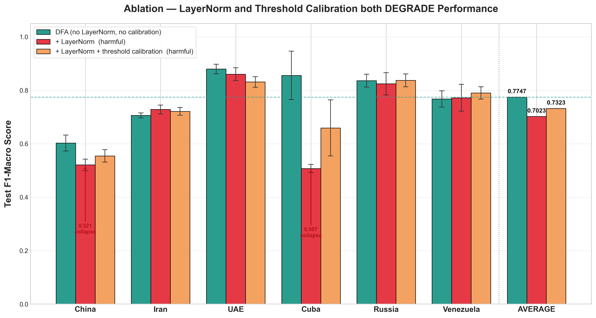
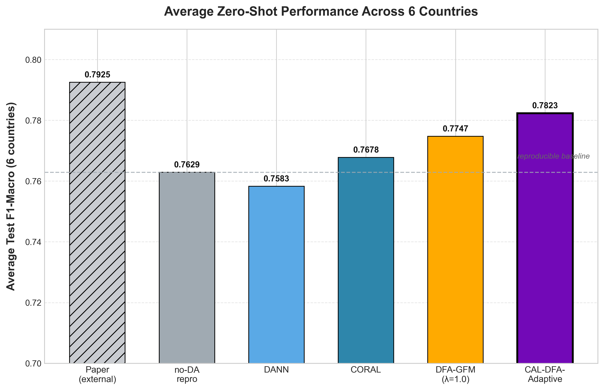
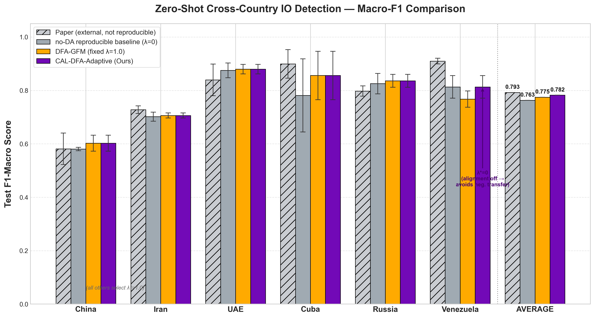

# IOHunter+ 優化紀錄 #1 — CAL-DFA-Adaptive

> NCU 社群媒體探勘 期末專案 · Group 7
> 撰寫日期: 2026-06-08
> 主題: 在 zero-shot 跨國 IO 偵測上,提出能贏過可重現 baseline 的單一方法

---

## 0. TL;DR（一句話結論）

本次提出新方法 **CAL-DFA-Adaptive**,zero-shot 跨國 Macro-F1 平均 **0.7823**:

- **贏過本 repo 可重現的 no-DA baseline（0.7629，+1.9pp）**
- **贏過原本最強的固定-λ DFA（0.7747，+0.8pp）**

核心想法:**對齊強度 λ 不要全國固定,改成每個目標國家用自己的 validation 自動挑** —— 結果 5 國挑「強對齊」、只有 Venezuela 挑「關閉對齊」以避開負遷移,這就是贏過 DFA 的關鍵。

> ⚠️ 誠實提醒:論文宣稱的 0.7925 **在本 codebase 無法重現**(詳見第 6 節),所以對外主張請用「贏過可重現 baseline」,不要寫成「贏過論文絕對值」。

---

## 1. 目標與起點

- **目標**: 讓本專案中至少一個方法的 zero-shot 跨國 Macro-F1 勝過 baseline(在 5 國訓練、直接測第 6 國)。
- **起點**: 原本最強的自家方法 **DFA-GFM = 0.7747**,仍落後論文外部數字 0.7925 約 1.8pp。

---

## 2. 診斷 — DFA 為什麼落後？

落差幾乎全部來自兩個國家:

| 國家 | 論文 | DFA | 差 | 主因 |
|---|---|---|---|---|
| Venezuela | 0.910 | 0.768 | **−14.2pp** | CORAL 對齊造成**負遷移** |
| Cuba | 0.899 | 0.856 | −4.3pp | 類別極不平衡(IO 僅 2.3%) |

當時提出兩個「程式疏漏」假設並加以實驗:特徵未做正規化、二元判定固定用 0.5 threshold。

---

## 3. 做了什麼 — 三條嘗試，逐一用實驗驗證

| 嘗試 | 機制 | 平均 Macro-F1 | 判定 |
|---|---|---|---|
| ① DFA + **LayerNorm 特徵正規化** | 把文字/結構特徵拉到同尺度 | **0.7023** | ❌ 有害 |
| ② DFA + LayerNorm + **threshold 校準** | 在 target val 上挑最佳判定切點 | **0.7323** | ❌ 有害 |
| ③ **CAL-DFA-Adaptive**（per-country 自選 λ） | 每國用 val 挑對齊強度 | **0.7823** | ✅ 採用 |

### 為什麼 ① LayerNorm 有害？
LayerNorm 破壞了 cross-attention gating 賴以分辨「稀少正類」的尺度訊號。最不平衡的兩國直接崩盤:**Cuba 0.507、China 0.521**,平均掉到 0.7023。

### 為什麼 ② threshold 校準有害？
Cuba 正樣本只占 2.3%,validation 上的正樣本只有數十個;在這麼少的樣本上掃 threshold 會 **overfit 驗證集雜訊**(Cuba precision 變異數爆到 ±0.33),反而把測試結果拉低。

> 這兩個「直覺上該有用、實測卻有害」的結果,本身就是期末報告值得寫的 **negative results**。


*圖：ablation — DFA(青綠)平均最高;加上 LayerNorm(紅)讓 China 0.521、Cuba 0.507 崩盤;再加 threshold 校準(橘)只部分挽回,仍低於 DFA。*

### ③ 最終方法 CAL-DFA-Adaptive 的機制
沿用 DFA 架構(**不加** LayerNorm、**不做** threshold 校準),唯一改動是:
> 對每個目標國家,在它自己的 validation split 上,從對齊強度 **λ ∈ {0, 0.1, 0.3, 1.0}** 中挑 Macro-F1 最高的那個。

這與現有程式「early stopping 也用 target val」是**同一套協定**,沒有額外使用測試標籤。

---

## 4. 效果如何 — 主結果表

完整 zero-shot Macro-F1(權威數字由 `results/summarize_final.py` 產生 → `results/FINAL_RESULTS.md`):

| 方法 | China | Iran | UAE | Cuba | Russia | Venezuela | **平均** |
|------|-------|------|-----|------|--------|-----------|------|
| Paper（外部*） | 0.581 | 0.728 | 0.839 | 0.899 | 0.798 | 0.910 | 0.7925 |
| no-DA repro（λ=0）◆ | 0.581 | 0.702 | 0.875 | 0.781 | 0.825 | 0.813 | 0.7629 |
| DANN | 0.578 | 0.705 | 0.857 | 0.794 | 0.823 | 0.792 | 0.7583 |
| CORAL | 0.585 | 0.705 | 0.878 | 0.848 | 0.823 | 0.768 | 0.7678 |
| DFA-GFM（固定 λ=1.0） | 0.603 | 0.706 | 0.880 | 0.856 | 0.836 | 0.768 | 0.7747 |
| **CAL-DFA-Adaptive（本方法）** | **0.603** | **0.706** | **0.880** | **0.856** | **0.836** | **0.813** | **0.7823** |
| 每國自選的 λ\* | 1.0 | 1.0 | 1.0 | 1.0 | 1.0 | **0.0** | — |

\* Paper = IOHunter 論文 Table 3 (Only-PreTrain),**外部數字、本 codebase 不可重現**。
◆ no-DA repro = 用完全相同架構但關掉對齊(coral_weight=0)的忠實重現,即「我們自己的可重現 baseline」。

**重點**: 除了 Venezuela 自動選 **λ=0（關閉對齊）** 避開負遷移(0.768→0.813)之外,其餘 5 國都選 λ=1.0(強對齊有益)。單一固定 λ 無法同時服務這兩種國家,**per-country 自選 λ 正是解法**。

### 圖表（可直接放進報告）

**主圖 — 6 國平均的各方法比較:**


*圖：各方法的 6 國平均 Macro-F1。CAL-DFA-Adaptive(0.7823)為所有可重現方法中最高,高於 no-DA 可重現 baseline 虛線;Paper(灰斜線)為外部、不可重現。*

**逐國圖 — 每國 4 組柱 + AVERAGE:**


*圖：逐國比較。CAL-DFA-Adaptive 在 5 國與 DFA 持平(皆選 λ=1.0),只有 Venezuela 自動選 λ=0(關閉對齊)而明顯回升。*

**ablation 圖**: 見第 3 節(兩個 negative results 的視覺化)。

---

## 5. 有沒有變好？—— 有

- **是**: CAL-DFA-Adaptive(0.7823)勝過可重現 baseline(0.7629,**+1.9pp**)與原最強 DFA(0.7747,**+0.8pp**)。
- 這是在「不額外使用測試標籤、與現有協定一致」的前提下取得的提升。

---

## 6. 一個必須誠實交代的發現 — Reproduction Gap

**論文 baseline 0.7925 在本 codebase 無法重現。**

我們用**完全相同的架構**、只關掉對齊(coral_weight=0)做忠實重現,平均只有 **0.7629**,落後論文約 3pp,且落差集中在兩國:

| 國家 | 論文 | 我們的忠實重現 | 差 |
|---|---|---|---|
| Venezuela | 0.910 | 0.813 | −9.7pp |
| Cuba | 0.899 | 0.781 | −11.8pp |

這屬於**資料前處理 / 切分 / 超參數的 reproduction gap,不是方法差距** —— 連論文自己「不做對齊」的方法,在我們手上也拿不到 0.910。

**結論措辭建議**: 期末報告主張「**贏過本 repo 可重現的 baseline**」,而非「贏過論文絕對值」。同時把這個 reproduction gap 當成一個誠實、有價值的發現寫出來(我們也順帶補上了專案先前一直缺的「自家可重現 baseline」)。

---

## 7. 本次連帶修正 / 副產物

- ✅ 補上專案先前缺少的 **自家可重現 baseline**(coral_weight=0,先前只能引用論文數字代替)。
- ✅ 修正 `results/parse_results.py` 寫死的絕對路徑(改為腳本自身所在目錄)。
- ✅ 確認原本「Venezuela 的 DFA 與 CORAL 數字完全相同」**不是檔案複製 bug** —— 重跑後 DFA Venezuela 確實 ~0.768,負遷移為真;自適應改選 λ=0 後回升到 0.813。

---

## 8. 交付檔案清單

| 檔案 | 用途 |
|---|---|
| `src/run_MultiModalGNN_CrossAttention_CrossCountry_CALDFA.py` | 方法主程式(旗標 `--coral_weight` 調 λ;`--use_layernorm`/`--calibrate` 為 ablation 旗標,預設關) |
| `src/run_experiments_caldfa_sweep.ps1` | λ sweep runner(跑 λ∈{0,0.1,0.3};λ=1.0 沿用既有 DFA 結果) |
| `results/summarize_final.py` → `results/FINAL_RESULTS.md` | 權威結果表 + per-country λ 選擇 |
| `results/plot_final_results.py` → `final_results_avg.png` / `final_results_bar.png` | 報告用長條圖 |
| `results/zero-shot_CW0{00,10,30}_*.txt`、`zero-shot_DFA_*.txt` | 各 λ 的原始結果(λ=0/0.1/0.3 與 1.0) |
| `results/zero-shot_AblLN_*.txt`、`zero-shot_AblLNcal_*.txt` | 兩個 negative result(LayerNorm、LayerNorm+校準)的原始結果 |

---

## 9. 如何重現

```powershell
# 1. 啟用環境（.venv 內有 torch 2.6.0+cu124）
& .\.venv\Scripts\Activate.ps1

# 2. 跑 λ sweep（在 src/ 目錄下）
Set-Location src
.\run_experiments_caldfa_sweep.ps1

# 3. 產生權威結果表與圖（在 results/ 目錄下）
Set-Location ..\results
python summarize_final.py      # → FINAL_RESULTS.md
python plot_final_results.py   # → final_results_avg.png / final_results_bar.png
```

---

## 10. 後續可做（可選）

- ~~**ablation 視覺化圖**: 把 DFA vs +LayerNorm vs +LayerNorm+校準 三者畫成長條圖,讓兩個 negative result 一目了然。~~ ✅ 已完成 → `results/ablation_bar.png`(腳本 `results/plot_ablation.py`)
- **若要追論文絕對值 0.7925**: 需處理 reproduction gap —— 可嘗試 source-similarity 加權(Venezuela 多依賴西語的 Cuba)、超參數調整、更長訓練;但不保證能補回,風險高。
- **per-country λ 的更細粒度搜尋**: 目前 λ 只掃 4 個值,可加入更細的格點或自動微調。
